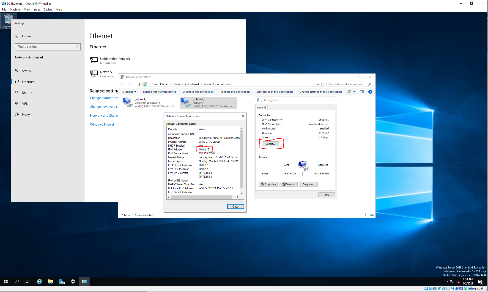

After downloading and installing Virtual box and the extension pack, as well as all of the iso's needed for this lab. Open virtual box to create our domain controller.

# Create and Configure Domain Controller Machine

In virtual box, click on the `New` icon at the top.

For the name create something easy, in this case I'll use `DC` for domain controller. Make sure the type is set to `Microsoft Windows` and the version is `Other Windows (64-Bit)` then click next

Next we will select how much RAM our machine will have. We can set our machine to have 2gb of Ram, however we can always change this later if needed. After doing so we can click continue through the rest of the prompts

After creating the virtual machine we need to set a few different settings. With our new DC machine selected click on the `Settings` at the top of the page.

On the settings page, select `System` then the `Processor` tab.
If you have multiple CPU cores on your system you can give it more than one, which will speed up some of the processes. However, it is not necessary. I set mine to 4 CPUs for this lab

Next we need to add another network interface card(NIC). To do so click the `Network` tab on the left. Looking back at our architecture diagram we can see on our domain controller we need two NICs one that will face the internet. This one is set by default in viirtual box as `Adapter 1` and is attached to `NAT`.

To create our internal NIC we need to click the `Adapter 2` tab. Check the `Enable Network Adapter` box and change `Attached to:` to Internal Network then click ok.

We are finally ready to launch our machine however it does not have an Operating system installed. Double click on the machine and you will see a dialoge box asking for a start up disk. You can click the folder to add your windows server 2019 iso that was downloaded. Then click start.

Once the machine loads, proceed with a normal windows installation. During the setup it will as you to select an operating system. Make sure that you use either of the `Desktop Experiences` doing so will give you a GUI to work wiith vs just a CMD line iinterface. 

After clicking next and waiting for the install to complete, it will take several minutes where the server will restart and ask you to push any key to boot, please sit tight until it prompts you to create the admin user with a password. After that is done you should be able to log in to the machine with the credentials you set.

---

Next we need to set up our IP address to do so we click on the network symbol in the app tray and then click on our network connection.

Click on `Change adapter option`

Doing so will open a window with our two adapters. Right click on one and select `Status`. On the status page click `Details` and look at the IPv4 Address. In this case the adapter I selected has the DHCP server address for my ISP so I know this is the Internet facing adapter. 

Right click on the adapter and name it something so you can differentiate between the two adapters.

To set the Ip address, right click on the internal adapter and click `properties` then double click on `IPv4` Then click `Use the following IP addresses` and set the parameters to what we have in our architecture diagram. 

