Now that we have our machine running, and the network set up, we can look to installing Active Directory domain services.

---

From the server manager dashboard click `Add roles and features`

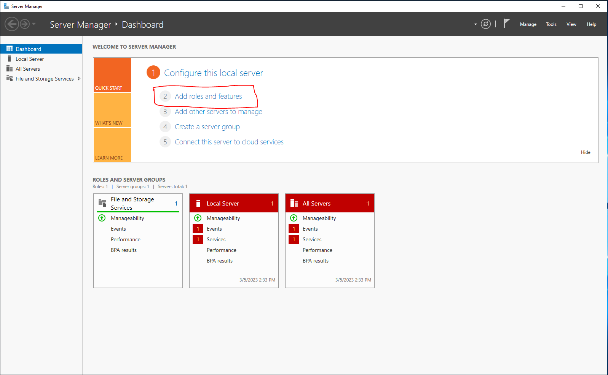

On the wizard screen, click `Next` three times until you get to the server roles. Make sure to click the box that says `Active Directory Domain Services.` Then click `Next` through the rest of the prompts.

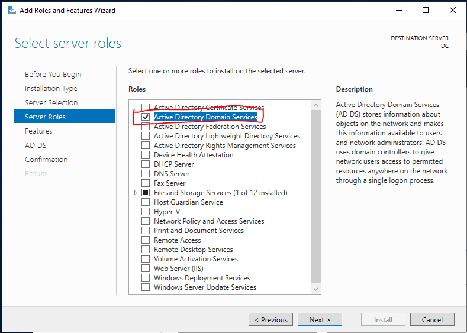

Once the iinstall is finished you will see a warning symbol with the flag at the top of the window. The warning says we enabled AD Domain services but there is no domain created. To do so click on `Promote this server to a domain controller`

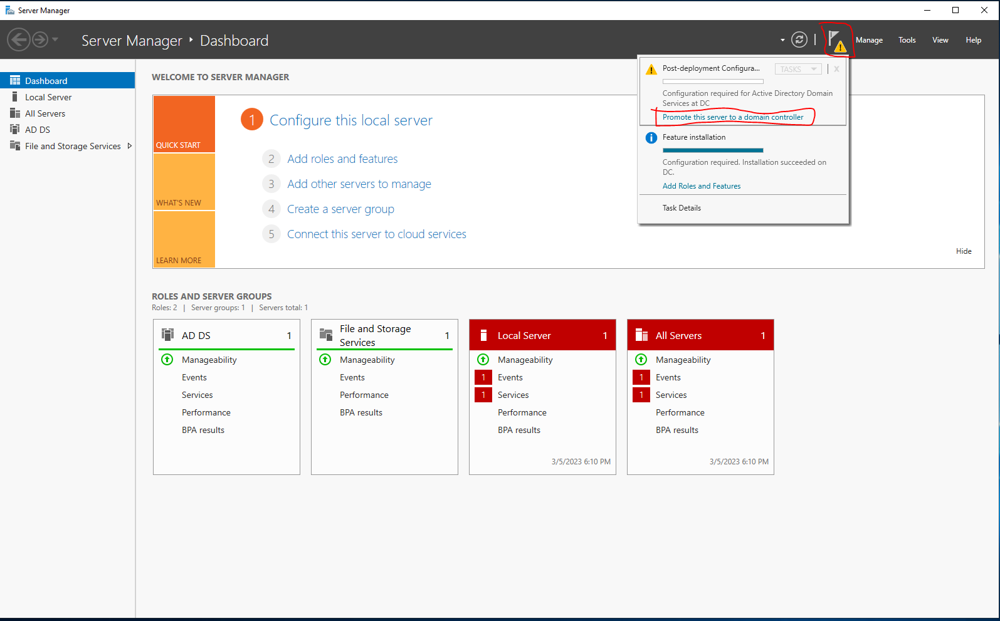

On the deployment configuration screen make sure to click `Add a new forest` and give your root domain a name. In this example we will use my domain.com.

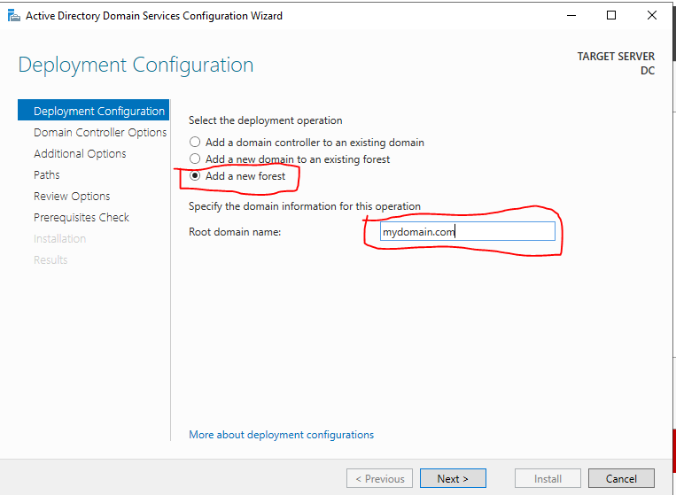

On the next page you will need to put in a password for the Directory Services Restore Mode so feel free to use whatever password you like and hit next. You can then push `Next` through the rest of the prompts and push `Install` when you come to it.

Once the install finishes it will automatically restart the machine. 

Notice upon restart, our username has changed to `MYDOMAIN\Administrator`

Instead of using the built in admin account we will create our own which we can do by going to `Start`, `Windows Administrative Tools`, then `Active Directory Users and Computers`.

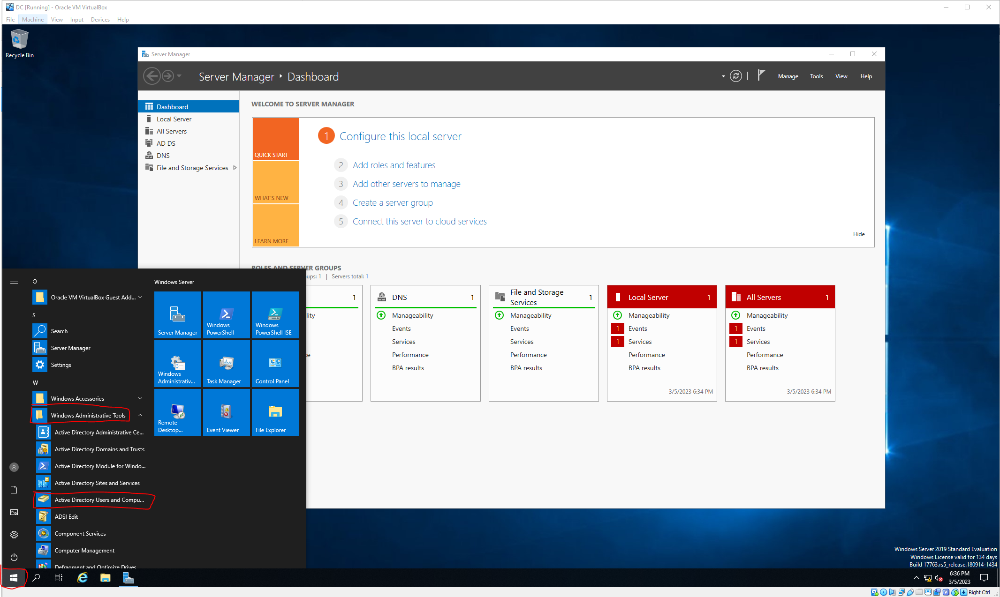

Once users and computers loads we see our domain listed on the left side of the window. Let's create a new Organizational Unit (OU) to put our admin account in. We can do so by right-clicking our domain, going to `New` and then to `Organizational Unit`

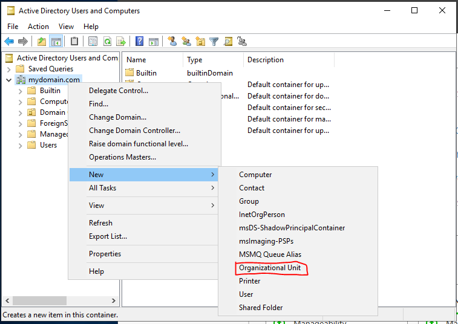

We named our OU _ADMINS and now we can create a new user for that OU by right-clicking our newly created OU, going to `New` and then to `User` We can then fill out our information using the `a-` to denote this is an admin account.

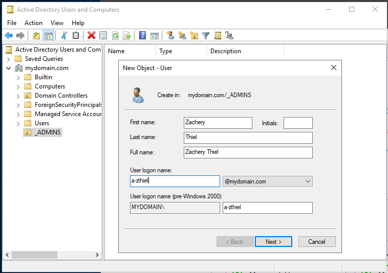

On the following screen you can create a password and uncheck the box that says `User must change password at next logon`

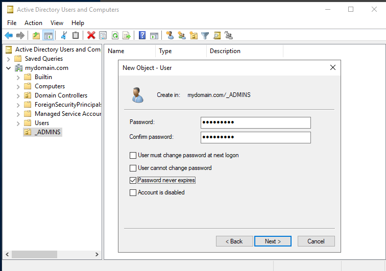

This will create the account, however it will not add it to the OU by default. We can ad it by right-clicking on our user and selecting `Properties` Then select the `Members Of` tab and hit `Add`. On the next window we can type `Domain Admins` and click the `check name` button. If the object name underlines that means it is good to go. If the group isn't listed it will bring up another window asking to verify name and remove the typos from the list.

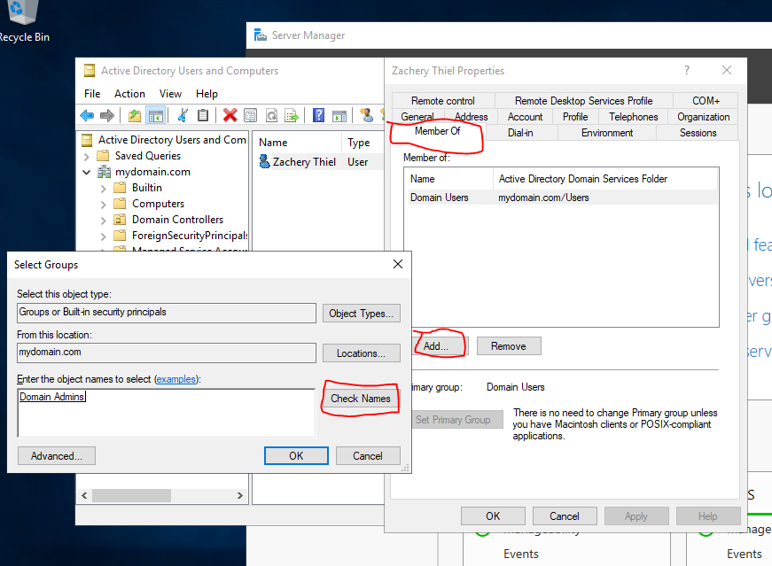

You can then sign out, and upon doing CTRL+ALT+DEL you can select other user in the bottom left of the screen. For the username you'll use whatever you set it to. For me it was a-zthiel, and log in with the password for the account.

The next thing we will install is our RAS (Remote Access Server)/NAT (Network Address Translation) which will allow our windows 10 client to be on the virtual private network but still be able to access the internet through the domain controller.

To do this, in the server manager dashboard we will go to `Add roles and features` much like the earlier install we can click `Next` until we get to the Server Roles tab where we will select `Remote Access`.

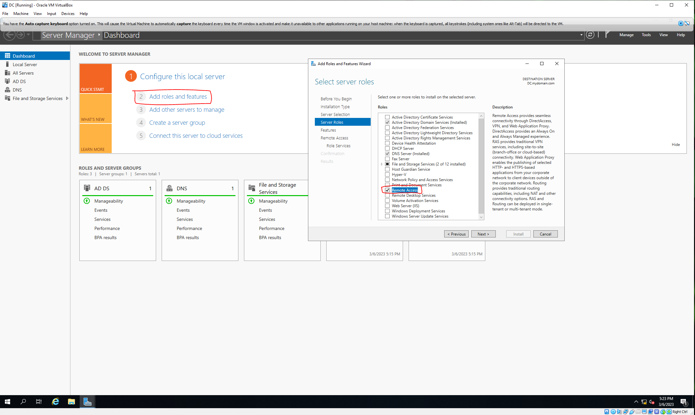

Then click `Next` until you get to the `Role Services` tab and check the box to enable `Routing`, click `Add features` once the window loads, then click `Next` until you are able to click `Install`

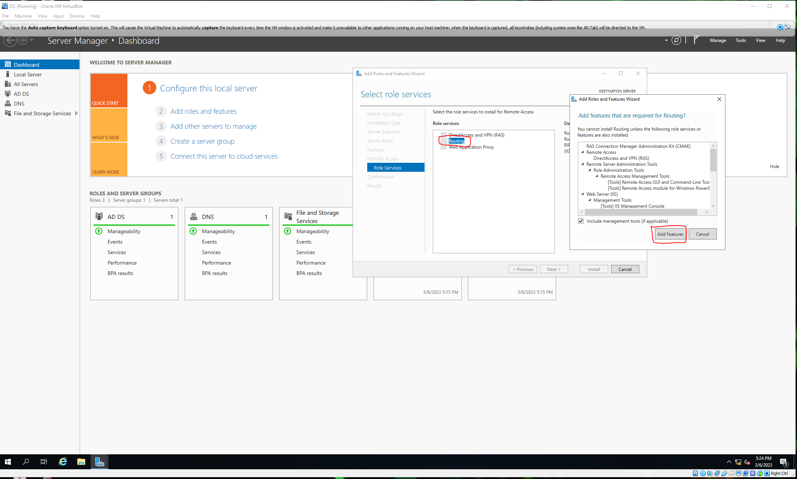

After the install finishes you can close the window and go to `Tools` and `Routing and Remote Access`

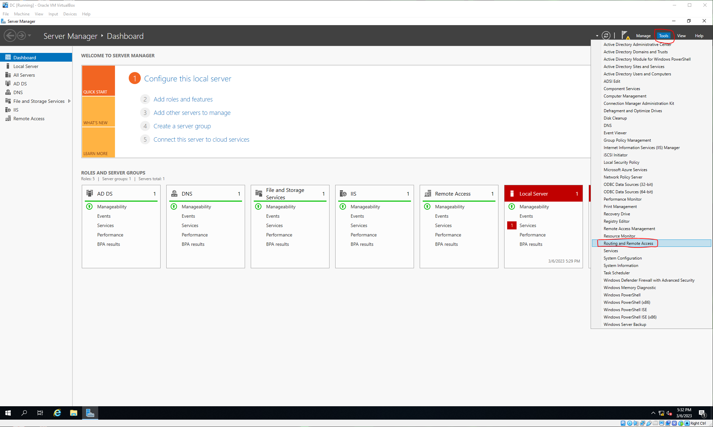

On the Routing and Remote Access window, right-click on DC and select `Configure and Enable Routing and Remote Access`

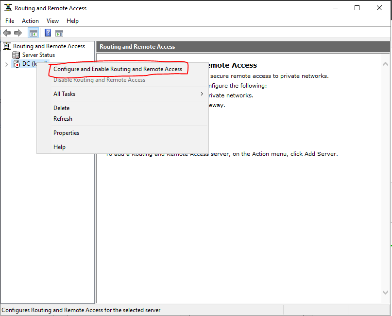

In the wizard, hit Next and make sure to select `Network address translation` 

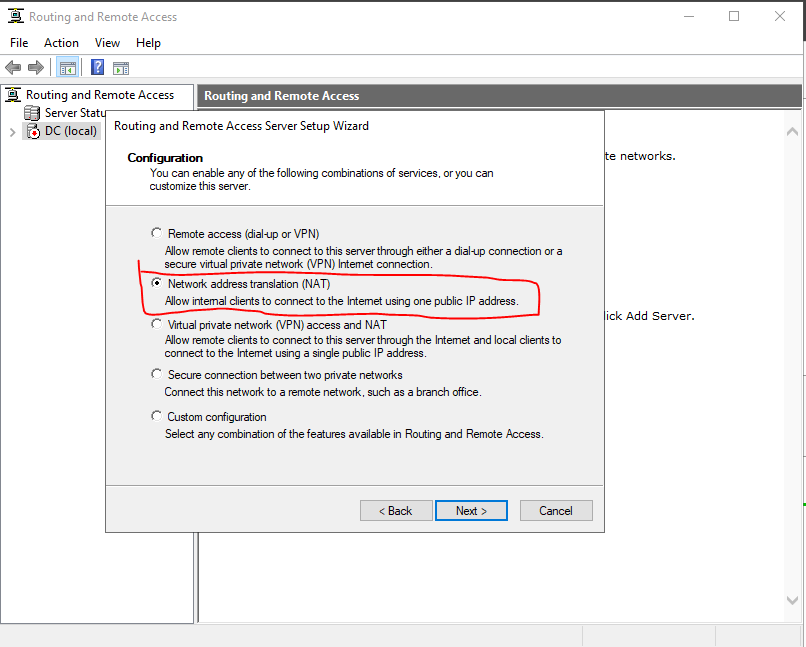

There is an issue where on the next page this option is grayed out and nothing shows in the network interfaces. If that is the case just reopen the Routing and Remote Access window through the tools menu. If it does have network interfaces listed select the public interface which you named to differentiate between the two. then click `Next` and `Finish`

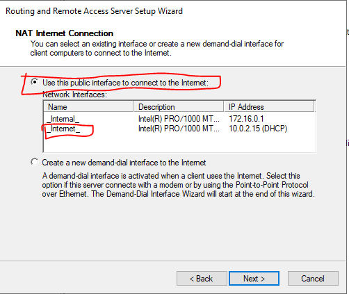

We will now set up our DHCP server within our domain controller. This will allow our Win10 client to get an IP address to access the internet a browse even though they are on the private internal network.

To do this, in the server manager dashboard we will go to `Add roles and features` much like the earlier install we can click `Next` until we get to the Server Roles tab where we will select `DHCP Server` then click `Add Features`. Then click `Next` until you have the option to `Install`

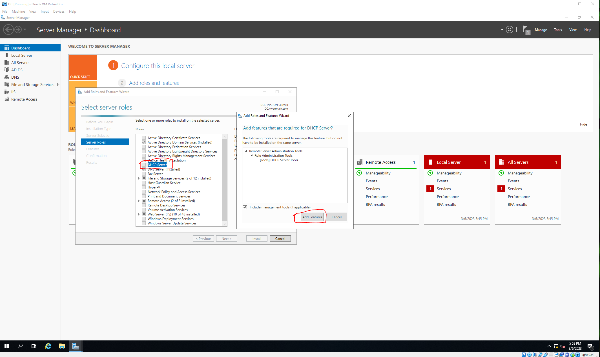

After the install finishes you can close the window and go to `Tools` and `DHCP`

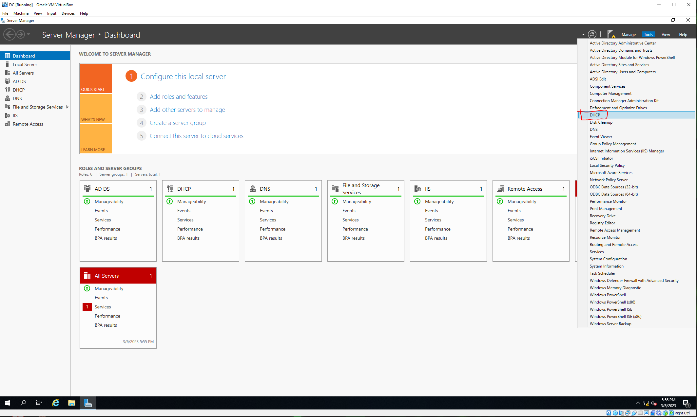

The whole purpose of DHCP is to allow computers on the newtork to automatically get IP addresses. Looking at our scope we can see the range of 172.16.0.100-200.

On the DHCP screen we can pull down the `dc.mydomain.com` and right-click on `IPv4` and select `New Scope`

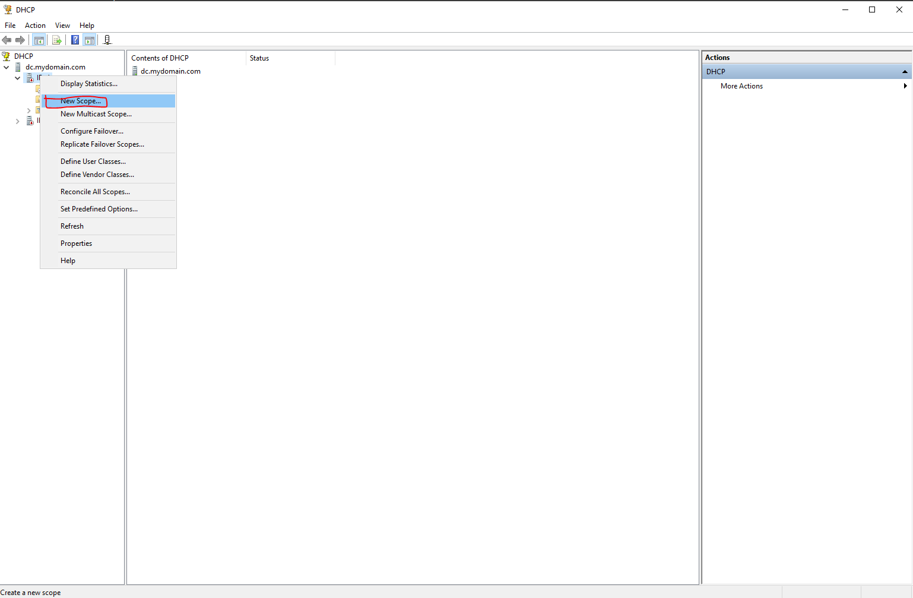

In the wizard you can select `Next` and give it whatever name you would like. I will name mine the same as the range in our diagram for ease of use. For the IP address range, we will set our starting IP to `172.16.0.100` and ending IP to `172.16.0.200` with the `Length` being set to `24`

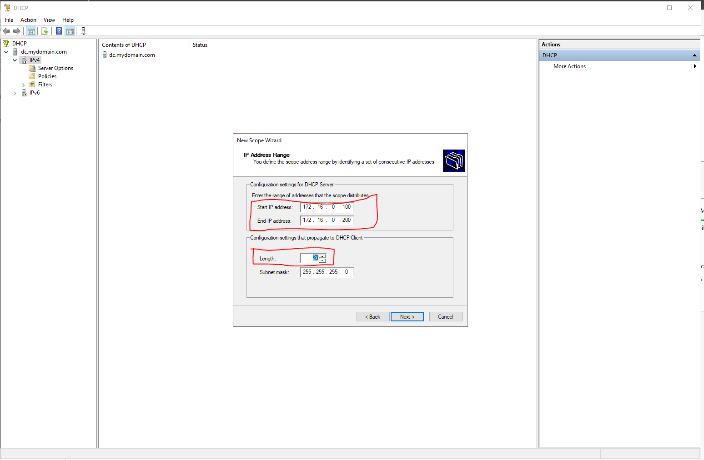

We do not need any exclusions so we can hit `Next`. For lease duration we can leave it at the default 8 days. Longer lease durations would be suitable for desktops that will remain on the network while shorter lease durations would be good for something like an iinternet cafe where users are constantly coming and going. We can click `Next` unitl you come to the default gateway screen. 

Make sure to input our internal NIC IP and click add. You can then click `Next` all the way to the end and click `Finish`

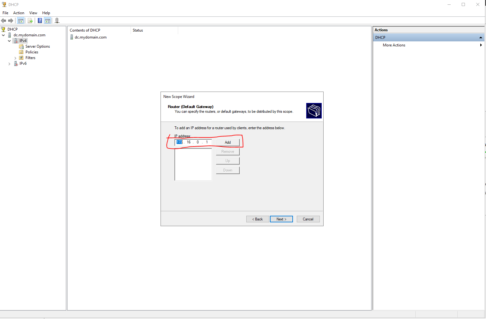

If, after finishing, your `IPv4` icon still has the red arrow you may have to right-click on `dc.mydomain.com` and select authroize. Then right-click on `dc.mydomain.com` and click `Refresh. The icons should change to green check marks.

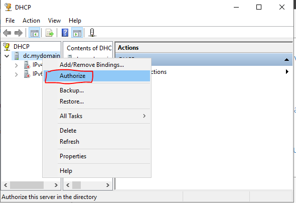

Now we can use Powershell to create example users so we do not have to manually create them.

[Continue to next step](https://github.com/zthiel1031/AD_Environment/tree/main/AD_Setup/Powershell%20User%20Creation)