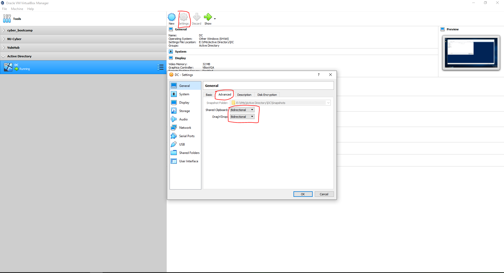
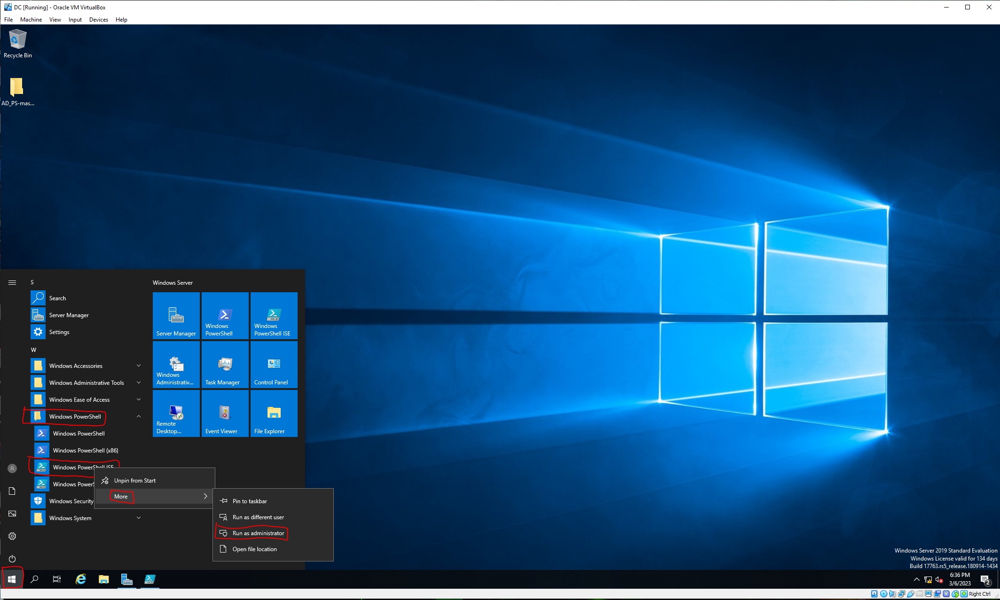

Now that we have created and configured the Domain Controller, and Installed and set up Active Directory it is time to creat our users in Powershell and add them to Active Directory. I have included the necessary file in the `Resources` folder. 

**All scripts and files were written by Josh Madakor. You can find his github at github.com/joshmadakor1**

For a walkthrough of the script and what each line does please visit this link:
[Powershell Script Walkthrough](https://www.youtube.com/watch?v=MHsI8hJmggI#t=35m10s)

To get the files on your DC, download them to your host computer, then make sure you have `Drag'n'Drop` set to `Bidirectional` in the Advanced tab under your Virtualbox Manager settings. THen you can drag and drop the files onto your desktop.



The names text file has 1000 randomly generated names. At the very top of the list add your name. 

To run this script go to `Start`> `Powershell`> right-click on `Powershell ISE` select more and say `run as administrator`



Then select `Open Script` (it will look like a file folder) navigate to where the scripts are saved, for me it is the desktop, and open the `CREATE_USERS` file.

In order to run this script we will have to enable the use of all scripts. Normally you would not want this enabled however because this is a Lab environment it is ok. In the Powershell terminal enter 

```
Set-ExecutionPolicy Unrestricted
```

And select `Yes to All`

In order to run this we need to navigate to the directory where the `names.txt` is held. To do so please enter this command in the terminal replacing `$user` with your actual username you are logged in to and `$location` with what ever directory you put the folder in.

```
cd C:\Users\$user\$location\AD_PS-master
```

To execute the script you can enter this command. Again replacing applicable variables where required.

```
C:\Users\$user\$location\AD_PS-master\1_CREATE_USERS.ps1
```

It will then start to create the users and you will see the output as they are created.


Now that we have users added to Active Directory the last step will be to create our Win10 machine and add it to the network. 

[Continue to next step](https://github.com/zthiel1031/AD_Environment/tree/main/AD_Setup/Win10%20Client)