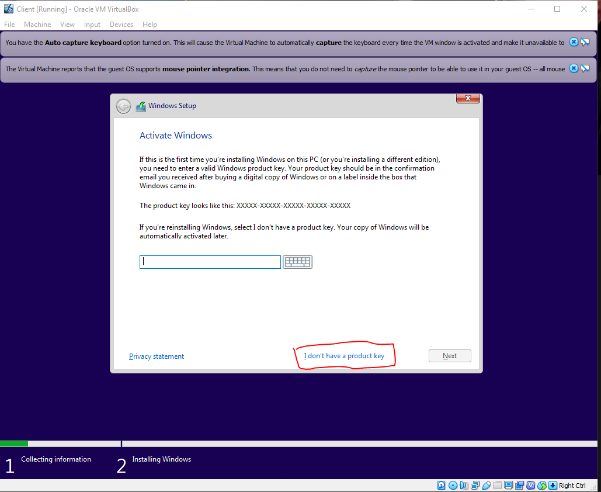

In virtual box, click on the `New` icon at the top.

For the name create something easy, in this case I'll use `Client`. Make sure the type is set to `Microsoft Windows` and the version is `Windows 10 (64-Bit)` then click next

Next we will select how much RAM our machine will have. We can set our machine to have 2gb of Ram, however we can always change this later if needed. After doing so we can click continue through the rest of the prompts

After creating the virtual machine we need to set a few different settings. With our new Client machine selected click on the `Settings` at the top of the page.

On the settings page, select `System` then the `Processor` tab.
If you have multiple CPU cores on your system you can give it more than one, which will speed up some of the processes. However, it is not necessary. I set mine to 4 CPUs for this lab

On the settings page, select `Network` and make sure adapter 1 is set to `Internal Network` and it should automatically generate the same internal network name we set for our domain controller.

We are finally ready to launch our machine however it does not have an Operating system installed. Double click on the machine and you will see a dialoge box asking for a start up disk. You can click the folder to add your windows 10 iso that was downloaded. Then click start.

Once the machine loads, proceed with a normal windows installation. During the setup it will as you to add a product key and you can say `I don't have a product key`

When select an operating system. Make sure that you use anything other than WIndows 10 Home as you will not be able to join the domain. For ours we will select `Windows 10 Pro`. 

Finally we need to attach our Client to the domain. To do so we will use the advanced renamee feature through our system's about page. To access this right-click on the `Start` icon and select `System`

Scroll down to the bottom of the window and select `Rename this PC (Advanced)`

The system properties window will appear and you will click on the box that says `Change` to add the computer to the domain and change it's name.

Make sure you select the bubble that says `Domain` and add it to `mydomain.com` and rename the computer.

You will then be required to enter a username and password to allow the computer to join the domain. For us we will use the admin account we created.

After clicking `Ok` it will take a minute and you will see a welcome to the domain screen and it will ask you to restart the system.

Upon restarting the computer will attempt to log in a the local user. Select `Other User` iin the bottom left of the screen and you will see that it now says we are signing in to the domain of `MYDOMAIN`. Pick any random user that was created and sign in as them to verify the accounts were created successfully.

