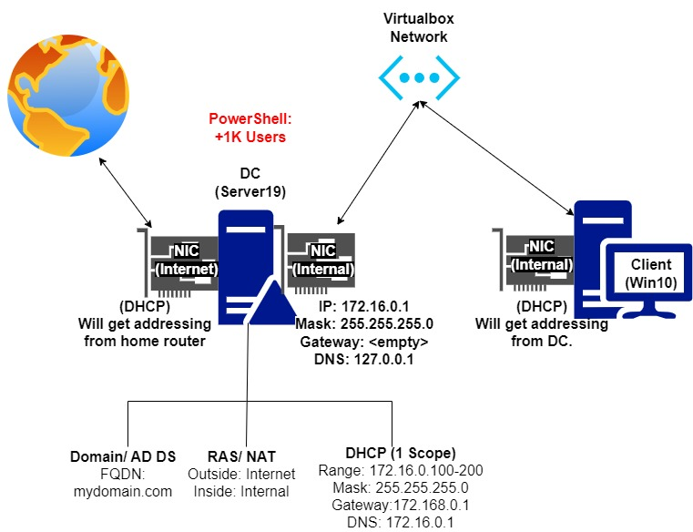

### **This repository aims to show you step by step how to set up active directory in your home lab environment.** 
 
 
Active Directory is a critical component of enterprise IT environments, providing a centralized repository for managing and securing user accounts, group policies, and network resources. However, for home labs, the importance of Active Directory may not be as significant.

That being said, having Active Directory in your home lab can still be beneficial for a few reasons:

- Familiarity with enterprise IT: If you are working towards a career in IT, having experience with Active Directory is essential. By setting up Active Directory in your home lab, you can gain practical experience with this critical enterprise technology and become more proficient in using it.

- Testing and experimentation: Active Directory is a complex system that can be challenging to set up and manage. Having a home lab with Active Directory allows you to experiment with various configurations and settings without affecting a production environment. This can help you learn more about how Active Directory works and prepare you for real-world scenarios.

- Security and access control: Active Directory can provide robust security and access control for your home lab environment. By setting up user accounts and group policies, you can ensure that only authorized users have access to your lab resources, and you can control what they can do with those resources.

 Overall, while having Active Directory in your home lab may not be necessary, it can be a valuable learning tool that can help you gain practical experience with enterprise IT, experiment with different configurations and settings, and enhance the security and access control of your lab environment.
 
 
 
 

 # There are a few prerequisite things we will need to start this lab.

 [Oracle VirtualBox Manager](https://www.virtualbox.org/wiki/Download_Old_Builds_6_1)  
 [ViirtualBox Extension Pack](https://download.virtualbox.org/virtualbox/6.1.42/Oracle_VM_VirtualBox_Extension_Pack-6.1.42.vbox-extpack)  
 [Windows Server 2019](https://www.microsoft.com/en-us/evalcenter/download-windows-server-2019)  
 [Windows 10](https://go.microsoft.com/fwlink/?LinkId=691209)

  
 
 
 
After Completing this Lab set up your architecture will look like this:  

